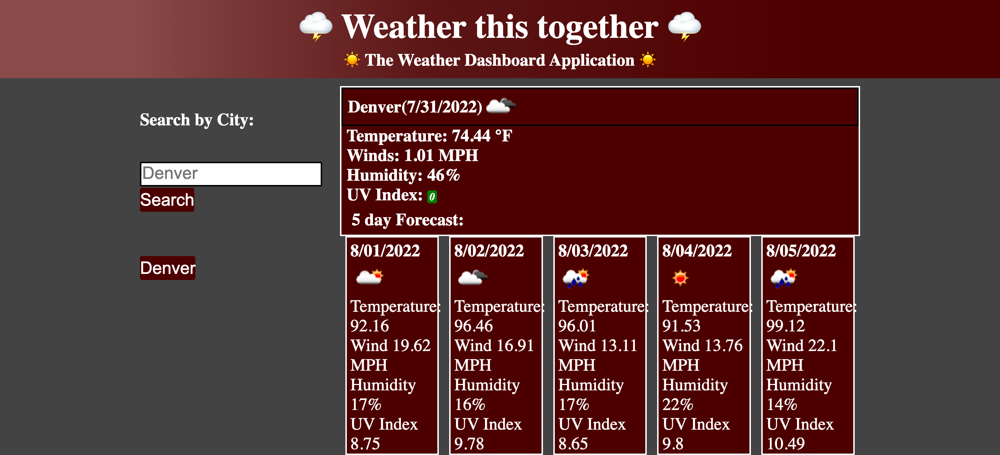

# Weather this Together: The Weather Dashboard Application
This is a weather application to keep track of the weather in multiple locations for the common day traveling buisness associate.
## Table of Contents
    -Introduction
    -Technologies
    -Link to Deployed Application
    -Screenshot
### Introduction
This application allows you to keep track of current and 5-day forecast of different cities and will keep the recently searched saved as buttons for your ease to keep track of planning. 
### Technologies 
    -HTML
    -CSS
    -JavaScript(w/Jquery)
    -WebAPI/Local Storage
    -Server-side API: Thank you to Open Weather Map and their developers
    -Moment.Js(w/ Jquery)
### Link to Deployed Application
https://moyuh.github.io/weather-forecast-app/

### Screenshot and GIF of Webpage
Image:

GIF:

